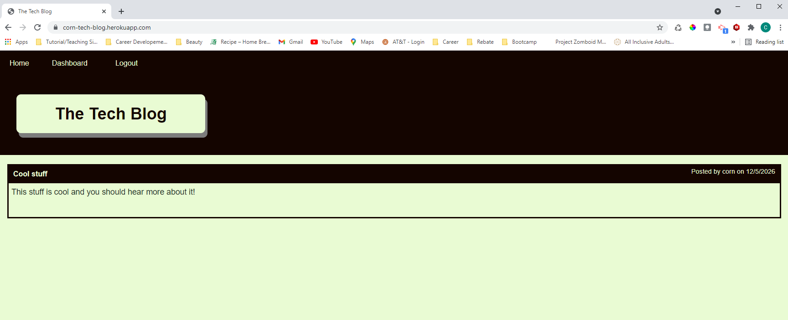
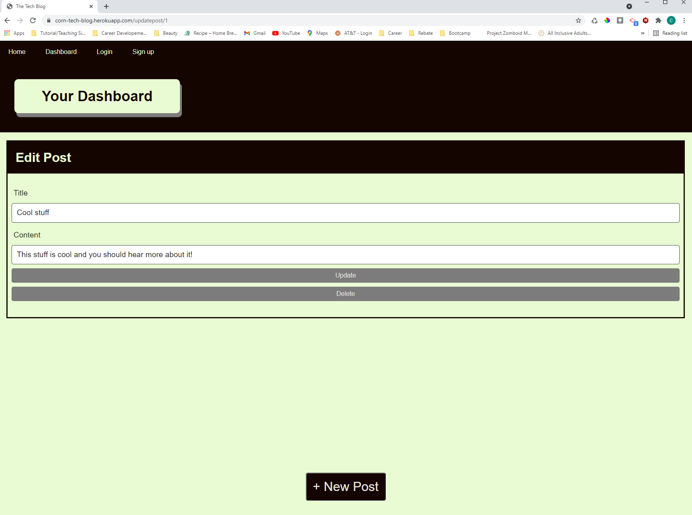

# Tech Blog
## Description
This project is a blog for users to post about tech - though there is no validation to make sure users don't non-tech related content.

Live Link: [TechBlog heroku app](https://corn-tech-blog.herokuapp.com/)

---
## Table of Contents
- [Installation](#installation)
- [Usage](#usage)
- [Credits](#credits)
- [License](#license)
- [Questions](#questions)
---
## Installation
- clone project
- npm init
- npm install jest and inquirer

## Usage
Sign-up and post your latest tech news or comment on someone elses post. No need to log in again - once you've signed up , the app automatically logs you in. 

## Tests
No npm tests but 

## Credits
### People
- Nando Davila - https://github.com/nandodavila
- Garrett Bryan -  https://github.com/GarrettLB

### Resources
- https://coding-boot-camp.github.io/full-stack/heroku/deploy-with-heroku-and-mysql
- https://sequelize.org/master/manual/model-instances.html
- https://handlebarsjs.com/guide/partials.html#basic-partials
- https://stackoverflow.com/questions/59111392/using-findbypk-and-where-condition-in-sequelize
- https://www.w3schools.com/tags/att_input_type_hidden.asp
- https://developer.mozilla.org/en-US/docs/Web/CSS/CSS_Flexible_Box_Layout/Aligning_Items_in_a_Flex_Container
- https://ezgif.com/split/ezgif-2-1dcc9c370cf6.gif

## License

## Questions
Github UN: cormillionaire - [cormillionaire](https://github.com/cormillionaire)
You can contact me via email by emailing cormillionaire@gmail.com with your questions
